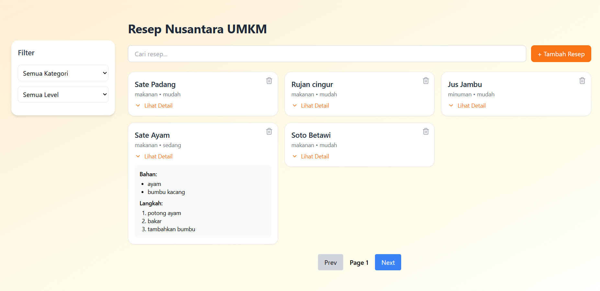
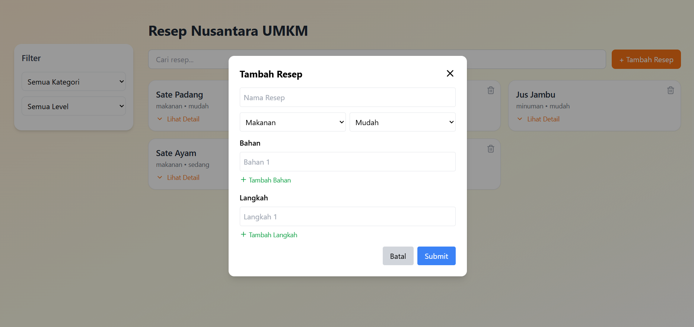
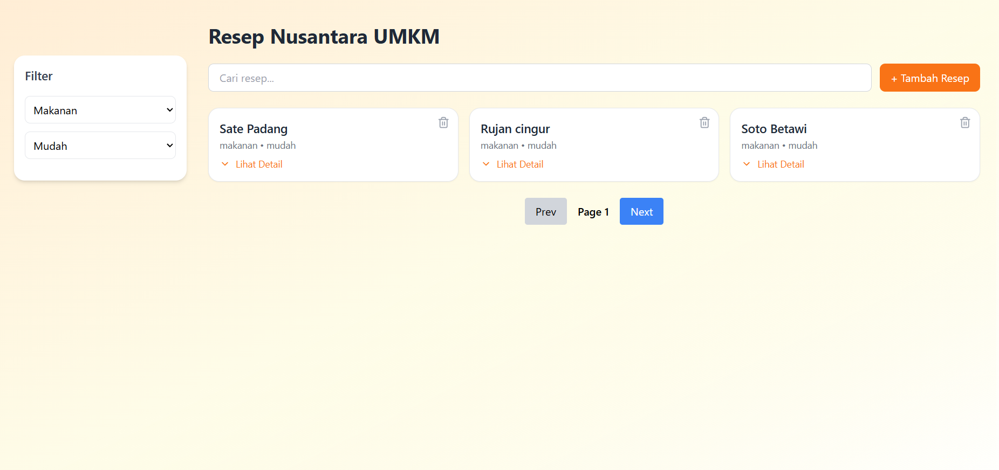

## Web Resep UMKM Nusantara

- **Nama** : Zulfikar Hasan  
- **NIM** : 2410501016  

---

Aplikasi web fullstack berbasis React.js Untuk bagian front-end yang bertujuan untuk mendukung digitalisasi 
UMKM di Indonesia dengan menyediakan platform berbagi resep masakan tradisional secara interaktif.

---

## Fitur Utama

- Menampilkan daftar resep dalam bentuk card (responsive grid)
- Filter resep menggunakan dropdown berdasarkan kategori & tingkat kesulitan
- Form tambah resep dengan dynamic field (bisa tambah lebih dari 1 bahan & langkah)
- Validasi form (minimal 1 bahan dan 1 langkah sebelum submit)
- Hapus resep
- Detail resep menggunakan accordion (collapsible component)
- State management reaktif terhadap perubahan filter dan pagination
- Konfirmasi sebelum submit data
- Feedback setelah aksi (notifikasi sukses / gagal)

---

## UI/UX
- Menggunakan Tailwind CSS
- Menggunakan component-based design pattern
- Icon modern dari Lucide React
- Animasi CSS transition saat expand/collapse accordion
- Responsive layout menggunakan grid system
- Modal interaktif untuk tambah resep
- Form tambah resep dirancang user-friendly dengan input dinamis

---

## Tech Stack
* React.js (Hooks)
* Tailwind CSS
* Lucide React (Icons) 
* Axios


---

## Screenshot Preview

<p>
  <h3> Home Screen
  
  </h3>
  <h3> Fitur Add Resep
  
  </h3>
  <h3> Fitur Filter
  
  </h3>
</p>

---
## Cara Menjalankan

### 1. Clone Repository
```bash
git clone <URL_REPOSITORY>
```

### 2. Ganti Directory
```bash
cd resep-frontend
```

### 3. Install Npm
```bash
npm install
```

### 4. Jalankan Aplikasi
```bash
npm run dev
```
